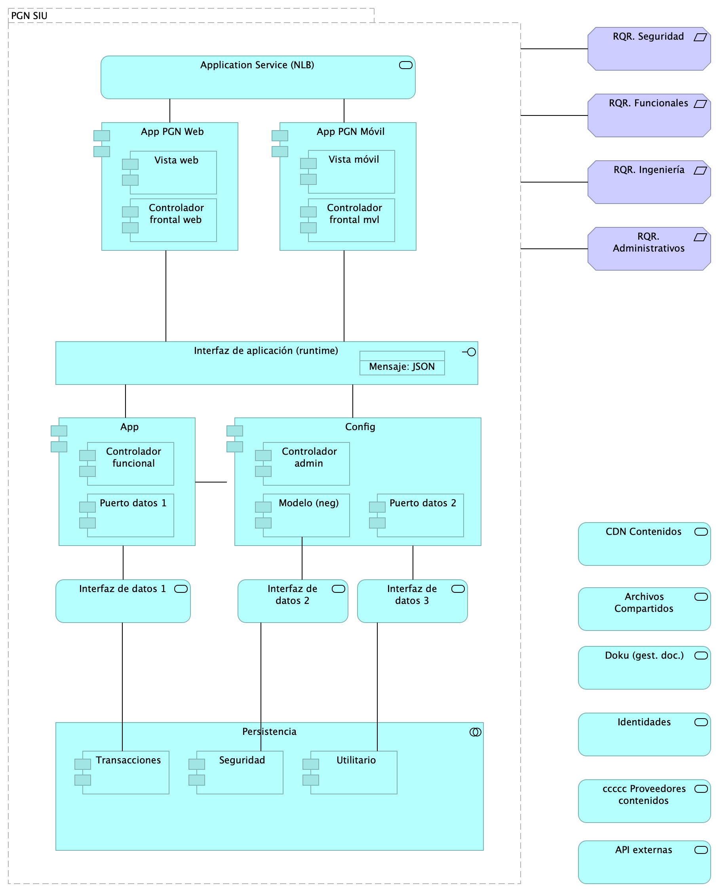
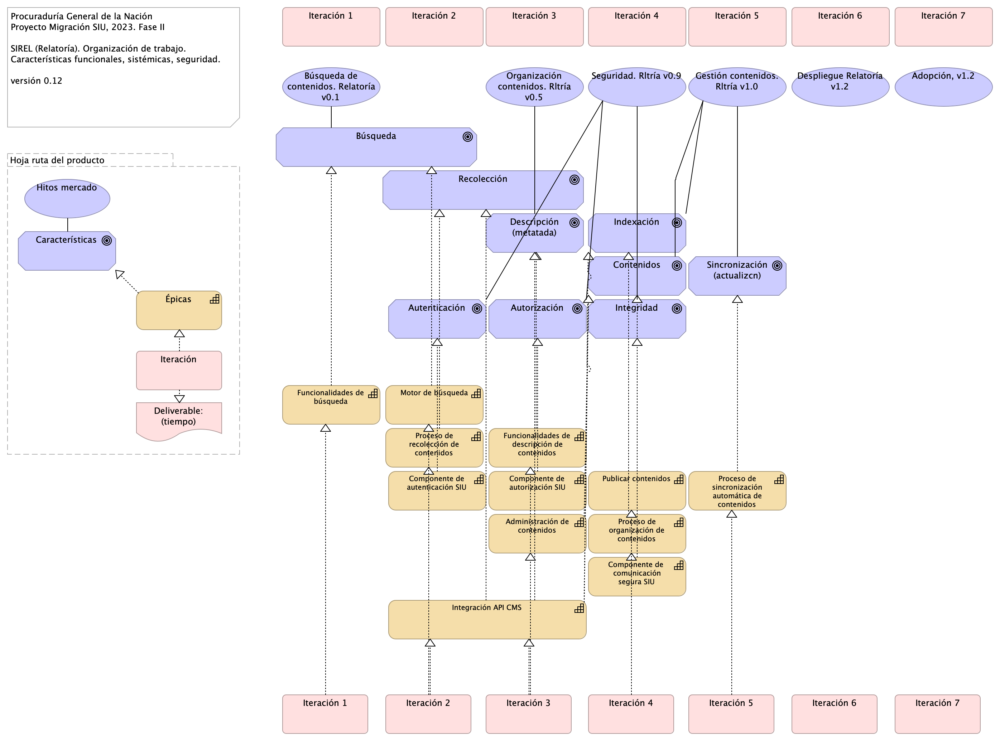
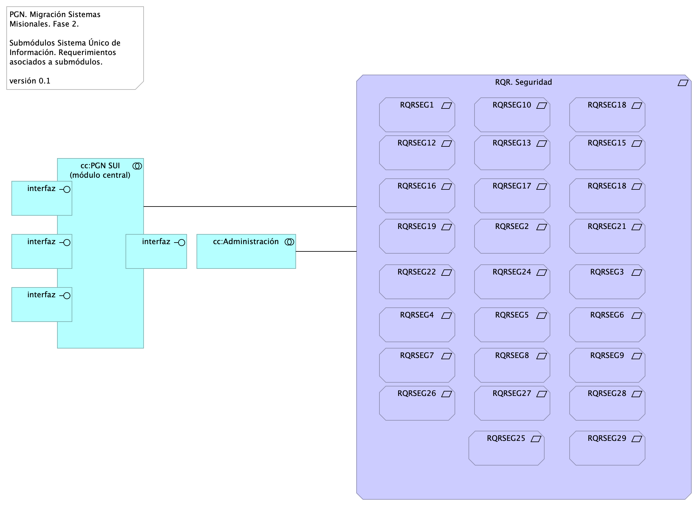

# Documento de Arquitectura Migración Funcional SUI
* [Patrón de Diseño Línea Base SUI PGN](#patrón-de-diseño-línea-base-sui-pgn)
	* [Lineabase.0.SIU applicación](#lineabase.0.siu-applicación)
	* [Lineabase.1.SIU componente](#lineabase.1.siu-componente)
	* [Lineabase.1a.SIU componentes. infraestrcutura](#lineabase.1a.siu-componentes.-infraestrcutura)
	* [Linebase.2.Portal](#linebase.2.portal)
	* [Riesgos.1. Migración funcional](#riesgos.1.-migración-funcional)
* [Patrón de Diseño Migración SUI PGN](#patrón-de-diseño-migración-sui-pgn)
	* [Migracion.1a.SIU submódulos](#migracion.1a.siu-submódulos)
	* [Migracion.1c.SIU submódulos componentes](#migracion.1c.siu-submódulos-componentes)
	* [Migracion.1b.SIU submodulos colaboración](#migracion.1b.siu-submodulos-colaboración)
* [Organización cambios arquitectura](#organización-cambios-arquitectura)
	* [Organización. 1n. Mapa producto](#organización.-1n.-mapa-producto)
	* [Organización. 1n.1. Mapa producto PGN. Relatoría](#organización.-1n.1.-mapa-producto-pgn.-relatoría)
* [Arquitectura de Seguridad, SUI Migración](#arquitectura-de-seguridad,-sui-migración)
	* [Seguridad. 1. Requerimientos](#seguridad.-1.-requerimientos)
	* [Seguridad. Linebase.2.Portal](#seguridad.-linebase.2.portal)

\newpage

# Patrón de Diseño Línea Base SUI PGN
## Lineabase.0.SIU applicación
{#fig:Lineabase.0.SIUapplicación width=}

Procuraduría General de la Nación, proyecto Migración SIU, 2023, Fase II. Línea base del sistema único de información (SUI en adelante) de la PGN. Presentación de componentes de software  originales implementados en la Fase I del presente proyecto.

## Representación Arquitectónica
Con una arquitectura orientada a servicios SUI recopila:

1. Runtime: Es el servicio que interactúa con el usuario final (GUI) elaborado en Angular 11
1. API Tx: Servicio api rest base node encargado de realizar las transacciones básicas CRUD
1. API Config / Seguridad. Servicio Web API .Net Framework encargado de gestionar características con la autenticación y configuración

### Catálogo de Elementos
| Name| Type| Description| Properties
|:--------|:--------|:--------|:--------|
|**Application Collaboration**|application-collaboration|||
|**Application Collaboration**|application-collaboration|||
|**App**|application-component||*plataforma:* node Js |
|**App PGN Móvil**|application-component|||
|**App PGN Web**|application-component||*plataforma:* angular 11 |
|**Config**|application-component||*plataforma:* cs |
|**Punto acceso público**|application-interface|URL tipo C HTTP||
|**Application Service (NLB)**|application-service||*plataforma:* angular 11 |
|**Interfaz de datos 1**|application-service|||
|**Interfaz de datos 2**|application-service|||

## Lineabase.1.SIU componente
{#fig:Lineabase.1.SIUcomponente width=5.89in}

Distribución de los servicios y paquetes que integran la aplicación de SUI. 

Cuatro paquetes con tecnologías respectivas

1. Angular 11 (Web)
1. API Transaccional (Node Js)
1. API Config (C#)
1. Persistencia (SQL)

Asuntos de la Migración:

* Estrategia CMS central
* Motor de búsqueda
* Estatego como BI
* Conciliación y Doku
* Gestión de sesiones / caducidad

### Catálogo de Elementos
| Name| Type| Description| Properties
|:--------|:--------|:--------|:--------|
|**Persistencia**|application-collaboration|||
|**App**|application-component||*plataforma:* node Js |
|**App PGN Móvil**|application-component|||
|**App PGN Web**|application-component||*plataforma:* angular 11 |
|**Config**|application-component||*plataforma:* cs |
|**Controlador admin**|application-component||*plataforma:* cs |
|**Controlador frontal mvl**|application-component||*plataforma:* js |
|**Controlador frontal web**|application-component||*plataforma:* js |
|**Controlador funcional**|application-component||*plataforma:* js |
|**Modelo (neg)**|application-component||*plataforma:* cs |
|**Puerto datos 1**|application-component||*plataforma:* js |
|**Puerto datos 2**|application-component||*plataforma:* cs |
|**Seguridad**|application-component||*plataforma:* sql |
|**Transacciones**|application-component||*plataforma:* sql |
|**Utilitario**|application-component||*plataforma:* no-sql |
|**Vista móvil**|application-component||*plataforma:* js |
|**Vista web**|application-component||*plataforma:* html |
|**Interfaz de aplicación (runtime)**|application-interface||*plataforma:* angular 11 |
|**API externas**|application-service|||
|**Application Service (NLB)**|application-service||*plataforma:* angular 11 |
|**Archivos Compartidos**|application-service|||
|**CDN Contenidos**|application-service|||
|**Doku (gest. doc.)**|application-service|||
|**Identidades**|application-service|||
|**Interfaz de datos 1**|application-service|||
|**Interfaz de datos 2**|application-service|||
|**Interfaz de datos 3**|application-service|||
|**ccccc Proveedores contenidos**|application-service|||
|**Mensaje: JSON**|data-object|||
|**PGN SIU**|grouping|El objetivo principal de la arquitectura del SUI de la migración es la centralización de los conceptos misionales: concentrar los conceptos misionales en componentes aislados; dejar por fuera de estos componentes misionales todo lo distintos a la misionalidad de la PGN. Los objetivos secundarios de esta arquitectura SUI de la migración son flexibilidad y extensibilidad. Dichos objetivos son independientes. Es decir, estos pueden ser maximizados sin conclifcto entre ellos. ||
|**RQR. Administrativos**|requirement|||
|**RQR. Funcionales**|requirement|||
|**RQR. Ingeniería**|requirement|||
|**RQR. Seguridad**|requirement|Requerimientos de seguridad, SUI, Migración, en aspectos de comunicación, autenticación, autorización y (manejo de) sesiones. ||

## Lineabase.1a.SIU componentes. infraestrcutura
{#fig:Lineabase.1a.SIUcomponentes.infraestrcutura width=}

Dependencias de infraestructura entre los servicios que integran el modelo de aplicación de SUI, Migración. 

* Servidor de Canales (App PGN web y móvil)
* Servidor Web App (App SUI)
* Servidor Lappiz (Config SUI)
* Servidor BDD App (Transaccional)
* Servidor BDD Config (Configuración)

### Catálogo de Elementos
| Name| Type| Description| Properties
|:--------|:--------|:--------|:--------|
|**Persistencia**|application-collaboration|||
|**App**|application-component||*plataforma:* node Js |
|**App PGN Móvil**|application-component|||
|**App PGN Web**|application-component||*plataforma:* angular 11 |
|**Config**|application-component||*plataforma:* cs |
|**Controlador admin**|application-component||*plataforma:* cs |
|**Controlador frontal mvl**|application-component||*plataforma:* js |
|**Controlador frontal web**|application-component||*plataforma:* js |
|**Controlador funcional**|application-component||*plataforma:* js |
|**Modelo (neg)**|application-component||*plataforma:* cs |
|**Puerto datos 1**|application-component||*plataforma:* js |
|**Puerto datos 2**|application-component||*plataforma:* cs |
|**Seguridad**|application-component||*plataforma:* sql |
|**Transacciones**|application-component||*plataforma:* sql |
|**Utilitario**|application-component||*plataforma:* no-sql |
|**Vista móvil**|application-component||*plataforma:* js |
|**Vista web**|application-component||*plataforma:* html |
|**Interfaz de aplicación (runtime)**|application-interface||*plataforma:* angular 11 |
|**API externas**|application-service|||
|**Application Service (NLB)**|application-service||*plataforma:* angular 11 |
|**Archivos Compartidos**|application-service|||
|**CDN Contenidos**|application-service|||
|**Doku (gest. doc.)**|application-service|||
|**Identidades**|application-service|||
|**Interfaz de datos 1**|application-service|||
|**Interfaz de datos 2**|application-service|||
|**Interfaz de datos 3**|application-service|||
|**ccccc Proveedores contenidos**|application-service|||
|**Mensaje: JSON**|data-object|||
|**Infraestructura SUI**|grouping|Soporte de infraestructura a los componentes del SUI Migración. Servidores y ambientes de cómputo para la ejecución del software base de los componentes misionales del SUI de PGN. ||
|**PGN SIU**|grouping|El objetivo principal de la arquitectura del SUI de la migración es la centralización de los conceptos misionales: concentrar los conceptos misionales en componentes aislados; dejar por fuera de estos componentes misionales todo lo distintos a la misionalidad de la PGN. Los objetivos secundarios de esta arquitectura SUI de la migración son flexibilidad y extensibilidad. Dichos objetivos son independientes. Es decir, estos pueden ser maximizados sin conclifcto entre ellos. ||
|**Servidor BDD App**|node|Sistema Operativo Windows Server 2019 Standard o Datacenter x64. RAM	8 GB. CPU 64 Bits, 4 Cores > 2 Ghz Discos	SO C: 126 GB, Backup E: 511 GB, SQL Data F: 510 GB, SQL Log   G: 510 GB, TempDB  G: 63.6 GB. ||
|**Servidor BDD Config**|node|Sistema Operativo Windows Server 2019 Standard o Datacenter x64. RAM	8 GB. CPU 64 Bits, 4 Cores > 2 Ghz Discos	SO C: 80 GB, Backup E: 250 GB, SQL Data F: 250 GB, SQL Log G: 250 GB, TempDB  G: 30 GB. ||
|**Servidor Lappiz **|node|Sistema Operativo Windows Server 2019 Standard o Datacenter x64. RAM 8 GB. CPU 64 Bits, 4 Cores > 2 Ghz Discos	SO C: 120 GB,  D: 16 GB. ||
|**Servidor Web App**|node|Windows Server 2019 Standard o Datacenter x64. Nombre físico. IP LAN. IP Pública. Windows Server 2019 Standard or Datacenter x64. RAM	8  GB. CPU	64 Bits. 4 Cores de 2 Ghz. Discos	SO C: 126 GB. SO D: 16 GB. ||
|**Servidor Web Canales**|node|Windows Server 2019 Standard o Datacenter x64. Nombre físico. IP LAN. IP Pública. Windows Server 2019 Standard or Datacenter x64. RAM	8  GB. CPU	64 Bits. 4 Cores de 2 Ghz. Discos	SO C: 126 GB. SO D: 16 GB. ||

## Linebase.2.Portal
{#fig:Linebase.2.Portal width=}

El portal es el conjunto de los elementos físicos y lógicos necesarios para la implementación de la granja de servidores de SharePoint Server 2019 para el portal de la PROCURADURIA.

* Servidores Web Front End
* Servidores de Aplicaciones
* Servidores de SQL Server

### Catálogo de Elementos
| Name| Type| Description| Properties
|:--------|:--------|:--------|:--------|
|**Application Collaboration Sharepoint**|application-collaboration|||
|**Servidor aplicaciones Sharepoint**|application-component|||
|**Servidor datos Sharepoint**|application-component|||
|**Servidor web Sharepoint**|application-component|||
|**Application Interface**|application-interface|||

## Riesgos.1. Migración funcional
{#fig:Riesgos.1.Migraciónfuncional width=}

Riesgos de la migración funcional:

* RSG1. Estrategia CMS central
* RSG2. Motor de búsqueda
* RSG3. Estatego como BI
* RSG4. Conciliación y Doku
* RSG5. Gestión de sesiones / caducidad

### Acciones de Mitigación

Informar a la PGN de las implicaciones junto con alternativas para la implementación de la acción de aprovechamiento: diseño del SCM central (sharepoint). La PGN debe decidir si o no a la acción propuesta.

Informar a la PGN de las implicaciones junto con alternativas para la implementación de la acción de aprovechamiento: diseño del motor de búsqueda compartido (sharepoint). La PGN debe decidir si o no a la acción propuesta.

Informar a la PGN de las implicaciones junto con alternativas para la implementación de la acción de manejo del riesgo: diseño de solución de inteligencia de negocio (Power BI). La PGN debe decidir si o no a la acción propuesta.

Informar a la PGN de las implicaciones junto con alternativas para la implementación de la acción de manejo del riesgo: ubicar la lógica, los flujos, y los datos misionales dentro del SIU. La PGN debe decidir si o no a la acción propuesta.

Informar a la PGN de las implicaciones junto con alternativas para la implementación de la acción de manejo del riesgo: facilitar la administración de seguridad en un solo lugar (distinto de localizarla en las aplicaciones web). La PGN debe decidir si o no a la acción propuesta.

### Catálogo de Elementos
| Name| Type| Description| Properties
|:--------|:--------|:--------|:--------|
|**RSG1. Estrategia CMS central**|constraint|Establecer desde el principio el gestor de contenidos compartido que los módulos del SUI migrados van a usar.||
|**RSG2. Motor de búsqueda compartido**|constraint|Establecer desde el principio el motor de búsqueda de conteidos compartido para los módulos del SUI migrados. ||
|**RSG3. Estatego como BI**|constraint|Definir la arquitectura de Estratego migrado: puede ser una solución de BI simple, o puede ser una aplicación web tradicional. ||
|**RSG4. Conciliación sin Doku**|constraint|Definir la ubicación de los componentes misionales de Conciliación Administrativa (SIU). Debe estar fuera de Doku. ||
|**RSG5. Gestión de sesiones / caducidad**|constraint|Establecer desde el principio el motor de búsqueda de conteidos compartido para los módulos del SUI migrados. ||
|**Riesgos Migración Funcional SIU**|constraint|||

\newpage

# Patrón de Diseño Migración SUI PGN
## Migracion.1a.SIU submódulos
{#fig:Migracion.1a.SIUsubmódulos width=}

Identificación de submódulos del Sistema Único de Información (SUI) de la PGN. 

Todos los sistemas de información del SUI siguen esta directiva: estarán constituídos por submódulos dispuestos en relación de utilitarios (que sirven) a los componentes misionales del SUI, ubicados en el centro en la diagrama. 

Los submódulos del SUI, tal como están presentados, reúnen a las partes que tienen el mismo rol en favor de la coherencia. Así mismo, estos pueden ser intercambiados o ampliados sin perjuicio del SUI gracias a las interfaces de unión (en favor de la extensibilidad).

Las interfaces de unión indicadas arriba obligan a los submódulos a cumplir las exigencias de los componentes misionales del SUI.

Los submódulos identificados tienen los siguientes roles para el SUI migrado:

1. cc:Presentación
1. cc:Servicios de aplicación
1. cc:Portales y canales
1. cc:Administración y configuración
1. cc:Almacenamiento

### Requerimientos Asociados a los Submódulos
La disposición de los módulos y submódulos presentada, denominada SUI Migración en adelante, facilita la focalización de los requerimientos encontrados en el levantamiento realizado por el actual proyecto. Así, por ejemplo, los requerimientos funcionales se encuentran concentrados en el submódulo de presentación (ver imagen).

### Catálogo de Elementos
| Name| Type| Description| Properties
|:--------|:--------|:--------|:--------|
|**cc:Administración**|application-collaboration|||
|**cc:Almacenamiento**|application-collaboration|||
|**cc:PGN SUI (misional)**|application-collaboration|||
|**cc:Portales y canales**|application-collaboration|Submódulo de portales internos de la PGN a donde llega el SUI. Interfaz web que usa al SUI para llegar a direcciones y subdirecciones de la PGN. La plataforma principal de portales en este contexto es Sharepoint de Microsoft. ||
|**cc:Presentación**|application-collaboration|Submódulo de presentación del SUI. interfaz gráfica, interfaz web visible a los usuarios clientes y funcionarios de la PGN. ||
|**cc:Servicios de aplicación**|application-collaboration|Submódulo de servicios utilitarios que sirven al SUI. Servicios variados que cumplen roles facilitadores de las actividades misionales del SUI. Ejemplos de estos servicios son los de gestión documental, implementado por Doku en el contexto de PGN. ||
|**interfaz**|application-interface|||
|**interfaz**|application-interface|||
|**interfaz**|application-interface|||
|**interfaz**|application-interface|||
|**interfaz**|application-interface|||
|**Cliente PGN**|business-actor|||
|**Funcionario PGN**|business-actor|||
|**RQR. Administrativos**|requirement|||
|**RQR. Funcionales**|requirement|||
|**RQR. Ingeniería**|requirement|||
|**RQR. Misionales**|requirement|||
|**RQR. Seguridad**|requirement|Requerimientos de seguridad, SUI, Migración, en aspectos de comunicación, autenticación, autorización y (manejo de) sesiones. ||
|**RQR. Seguridad**|requirement|Requerimientos de seguridad, SUI, Migración, en aspectos de comunicación, autenticación, autorización y (manejo de) sesiones. ||

## Migracion.1c.SIU submódulos componentes
{#fig:Migracion.1c.SIUsubmóduloscomponentes width=}

Presentación de los componentes internos de los submódulos del sistema único de información migración PGN. Organización intena de los servicios y paquetes que integran cada submódulo del SUI. Todos los sistemas de información del SUI siguen esta directiva: estarán constituídos por submódulos dispuestos en relación de utilitarios (que sirven) a los componentes misionales del SUI, ubicados en el centro en la diagrama. 

La organización de componentes de migración SUI facilita focalizar la selección de tecnologeias. Los componentes internos y tecnologías elegidas son las siguientes

1. Presentación: Angular 11 (Web)
1. PGN SUI: API Transaccional (Node Js)
1. Administración: API Config (C#)
1. Persistencia: (SQL)

Los submódulos del SUI, tal como están presentados, reúnen a las partes que tienen el mismo rol en favor de la coherencia. Así mismo, estos pueden ser intercambiados o ampliados sin perjuicio del SUI gracias a las interfaces de unión (en favor de la extensibilidad).

Las interfaces de unión indicadas arriba obligan a los submódulos a cumplir las exigencias de los componentes misionales del SUI.

### Catálogo de Elementos
| Name| Type| Description| Properties
|:--------|:--------|:--------|:--------|
|**App**|application-component||*plataforma:* node Js |
|**App PGN Móvil**|application-component|||
|**App PGN Web**|application-component||*plataforma:* angular 11 |
|**Config**|application-component||*plataforma:* cs |
|**Controlador admin**|application-component||*plataforma:* cs |
|**Controlador frontal mvl**|application-component||*plataforma:* js |
|**Controlador frontal web**|application-component||*plataforma:* js |
|**Controlador funcional**|application-component||*plataforma:* js |
|**Modelo (neg)**|application-component||*plataforma:* cs |
|**Puerto datos 1**|application-component||*plataforma:* js |
|**Puerto datos 2**|application-component||*plataforma:* cs |
|**Seguridad**|application-component||*plataforma:* sql |
|**Servidor aplicaciones Sharepoint**|application-component|||
|**Servidor datos Sharepoint**|application-component|||
|**Servidor web Sharepoint**|application-component|||
|**Transacciones**|application-component||*plataforma:* sql |
|**Utilitario**|application-component||*plataforma:* no-sql |
|**Vista móvil**|application-component||*plataforma:* js |
|**Vista web**|application-component||*plataforma:* html |
|**Application Interface**|application-interface|||
|**Interfaz de aplicación (runtime)**|application-interface||*plataforma:* angular 11 |
|**API externas**|application-service|||
|**Application Service (NLB)**|application-service||*plataforma:* angular 11 |
|**Archivos Compartidos**|application-service|||
|**CDN Contenidos**|application-service|||
|**Doku (gest. doc.)**|application-service|||
|**Identidades**|application-service|||
|**Interfaz de datos 1**|application-service|||
|**Interfaz de datos 2**|application-service|||
|**Interfaz de datos 3**|application-service|||
|**Office**|application-service|||
|**ccccc Proveedores contenidos**|application-service|||
|**Mensaje: JSON**|data-object|||
|**Administración**|grouping|||
|**Almacenamiento**|grouping|||
|**PGN SIU**|grouping|El objetivo principal de la arquitectura del SUI de la migración es la centralización de los conceptos misionales: concentrar los conceptos misionales en componentes aislados; dejar por fuera de estos componentes misionales todo lo distintos a la misionalidad de la PGN. Los objetivos secundarios de esta arquitectura SUI de la migración son flexibilidad y extensibilidad. Dichos objetivos son independientes. Es decir, estos pueden ser maximizados sin conclifcto entre ellos. ||
|**Portales**|grouping|Submódulo de portales internos de la PGN a donde llega el SUI. Interfaz web que usa al SUI para llegar a direcciones y subdirecciones de la PGN. La plataforma principal de portales en este contexto es Sharepoint de Microsoft. ||
|**Presentación**|grouping|Submódulo de presentación del SUI. interfaz gráfica, interfaz web visible a los usuarios clientes y funcionarios de la PGN. ||
|**Servicios de aplicación**|grouping|Submódulo de servicios utilitarios que sirven al SUI. Servicios variados que cumplen roles facilitadores de las actividades misionales del SUI. Ejemplos de estos servicios son los de gestión documental, implementado por Doku en el contexto de PGN. ||
|**RQR. Administrativos**|requirement|||
|**RQR. Funcionales**|requirement|||
|**RQR. Ingeniería**|requirement|||
|**RQR. Misionales**|requirement|||
|**RQR. Seguridad**|requirement|Requerimientos de seguridad, SUI, Migración, en aspectos de comunicación, autenticación, autorización y (manejo de) sesiones. ||
|**RQR. Seguridad**|requirement|Requerimientos de seguridad, SUI, Migración, en aspectos de comunicación, autenticación, autorización y (manejo de) sesiones. ||

## Migracion.1b.SIU submodulos colaboración
{#fig:Migracion.1b.SIUsubmoduloscolaboración width=}

Patrón de Distribución y Colaboración estándar para el SUI.

La colaboración y comunicación de los componentes internos del SUI (grupo PFN SUI, en el diagrama) está mediada por interfaces. Estas son provistas por el grupo de componentes misionales, PGN SUI, hacia los submódulos externos. La intención es mantener reducido y controlado el número de interfaces.

La colaboración entre el SUI Migración con sistemas externos puede darse mediante buses de datos empresarial, sin perjuicio del patrón de comunicación estadar descrito en el diagrama.

### Catálogo de Elementos
| Name| Type| Description| Properties
|:--------|:--------|:--------|:--------|
|**cc:Almacenamiento**|application-collaboration|||
|**cc:Almacenamiento**|application-collaboration|||
|**cc:PGN SUI (misional)**|application-collaboration|||
|**cc:PGN SUI (misional)**|application-collaboration|||
|**cc:Portales y canales**|application-collaboration|Submódulo de portales internos de la PGN a donde llega el SUI. Interfaz web que usa al SUI para llegar a direcciones y subdirecciones de la PGN. La plataforma principal de portales en este contexto es Sharepoint de Microsoft. ||
|**cc:Portales y canales**|application-collaboration|Submódulo de portales internos de la PGN a donde llega el SUI. Interfaz web que usa al SUI para llegar a direcciones y subdirecciones de la PGN. La plataforma principal de portales en este contexto es Sharepoint de Microsoft. ||
|**interfaz**|application-interface|||
|**interfaz**|application-interface|||
|**interfaz**|application-interface|||
|**interfaz**|application-interface|||

\newpage

# Organización cambios arquitectura
## Organización. 1n. Mapa producto
{#fig:Organización.1n.Mapaproducto width=3.14in}

### Catálogo de Elementos
| Name| Type| Description| Properties
|:--------|:--------|:--------|:--------|
|**Épicas**|capability||*modulo:* relatoria |
|**Deliverable: (tiempo)**|deliverable||*modulo:* relatoria |
|**Tiempo**|gap|||
|**Características**|goal||*modulo:* relatoria |
|**Hoja ruta del producto**|grouping||*modulo:* relatoria |
|**Hitos mercado**|value||*modulo:* relatoria |
|**Iteración**|work-package||*modulo:* relatoria |

## Organización. 1n.1. Mapa producto PGN. Relatoría
{#fig:Organización.1n.1.MapaproductoPGN.Relatoría width=}

Organización y distribución de las características técnicas y funcionales del módulo de Relatoría. 

Características principales:
* Utilización de metadatos
* Búsqueda de contenido (intradocumental y por metadatos)
* Procesos de recolección y sincronización de contenidos

De arriba a abajo: 
1. Fila 1, planificación de espacios de trabajo (iteraciones, para este caso) restringido al alcance del proyecto Migración PGN 2023.
1. Debajo, lo hitos importantes organizados en el tiempo.
1. Fila 3. Evolución de las características en los aspectos funcionales, técnico, hardware y software del módulo Relatoría de PGN. 
1. FInalmente, fila final del diagrama, la entrega en el tiempo de las capacidades del módulo de relatoría (épicas, para el caso de Scrum). La prioridad de liberación de estas la determina el equipo funcional de este módulo de la PGN.

 

### Catálogo de Elementos
| Name| Type| Description| Properties
|:--------|:--------|:--------|:--------|
|**Administración de contenidos**|capability||*modulo:* relatoria |
|**Componente de  comunicación segura SIU**|capability||*modulo:* relatoria |
|**Componente de autenticación SIU**|capability||*modulo:* relatoria |
|**Componente de autorización SIU**|capability||*modulo:* relatoria |
|**Funcionalidades de búsqueda**|capability||*modulo:* relatoria |
|**Funcionalidades de descripción de contenidos**|capability||*modulo:* relatoria |
|**Integración API CMS**|capability||*modulo:* relatoria |
|**Motor de búsqueda**|capability||*modulo:* relatoria |
|**Proceso de organización de contenidos**|capability||*modulo:* relatoria |
|**Proceso de recolección de contenidos**|capability||*modulo:* relatoria |
|**Proceso de sincronización automática de contenidos**|capability||*modulo:* relatoria |
|**Publicar contenidos**|capability||*modulo:* relatoria |
|**Épicas**|capability||*modulo:* relatoria |
|**Deliverable: (tiempo)**|deliverable||*modulo:* relatoria |
|**Autenticación**|goal||*modulo:* relatoria *caracteristica:* seguridad |
|**Autorización**|goal||*modulo:* relatoria *caracteristica:* seguridad |
|**Búsqueda**|goal||*modulo:* relatoria *caracteristica:* técnica, integración |
|**Características**|goal||*modulo:* relatoria |
|**Contenidos**|goal||*modulo:* relatoria *caracteristica:* técnica, integración |
|**Descripción (metatada)**|goal||*modulo:* relatoria *caracteristica:* técnica, integración |
|**Indexación**|goal||*modulo:* relatoria *caracteristica:* técnica, integración |
|**Integridad**|goal||*modulo:* relatoria *caracteristica:* seguridad |
|**Recolección**|goal||*modulo:* relatoria *caracteristica:* técnica, integración |
|**Sincronización (actualizcn)**|goal||*modulo:* relatoria *caracteristica:* técnica, integración |
|**Hoja ruta del producto**|grouping||*modulo:* relatoria |
|**Adopción, v1.2**|value||*modulo:* relatoria |
|**Búsqueda de contenidos. Relatoría v0.1**|value||*modulo:* relatoria |
|**Despliegue Relatoría v1.2**|value||*modulo:* relatoria |
|**Gestión contenidos. Rltría v1.0**|value||*modulo:* relatoria |
|**Hitos mercado**|value||*modulo:* relatoria |
|**Organización contenidos. Rltría v0.5**|value||*modulo:* relatoria |
|**Seguridad. Rltría v0.9**|value||*modulo:* relatoria |
|**Iteración**|work-package||*modulo:* relatoria |
|**Iteración 1**|work-package||*modulo:* relatoria |
|**Iteración 1**|work-package||*modulo:* relatoria |
|**Iteración 2**|work-package||*modulo:* relatoria |
|**Iteración 2**|work-package||*modulo:* relatoria |
|**Iteración 3**|work-package||*modulo:* relatoria |
|**Iteración 3**|work-package||*modulo:* relatoria |
|**Iteración 4**|work-package||*modulo:* relatoria |
|**Iteración 4**|work-package||*modulo:* relatoria |
|**Iteración 5**|work-package||*modulo:* relatoria |
|**Iteración 5**|work-package||*modulo:* relatoria |
|**Iteración 6**|work-package||*modulo:* relatoria |
|**Iteración 6**|work-package||*modulo:* relatoria |
|**Iteración 7**|work-package||*modulo:* relatoria |
|**Iteración 7**|work-package||*modulo:* relatoria |

\newpage

# Arquitectura de Seguridad, SUI Migración
## Seguridad. 1. Requerimientos
{#fig:Seguridad.1.Requerimientos width=}

### Catálogo de Elementos
| Name| Type| Description| Properties
|:--------|:--------|:--------|:--------|
|**cc:Administración**|application-collaboration|||
|**cc:PGN SUI (misional)**|application-collaboration|||
|**interfaz**|application-interface|||
|**interfaz**|application-interface|||
|**interfaz**|application-interface|||
|**interfaz**|application-interface|||
|**RQR. Seguridad**|requirement|Requerimientos de seguridad, SUI, Migración, en aspectos de comunicación, autenticación, autorización y (manejo de) sesiones. ||
|**RQRSEG1**|requirement|1. Las soluciones deben dar cumplimiento a las políticas institucionales del sistema de gestión de seguridad de la información establecidas por la entidad que busca garantizar la confidencialidad, integridad y disponibilidad de la información que se genera, procesa, almacena y/o transmite en los sistemas de Información de la Entidad.||
|**RQRSEG10**|requirement|1. Debe incluir un mecanismo de cifrado de los datos que se transportan entre los diferentes componentes tecnológicos y los datos sensibles de la base de datos que representen un alto nivel de confidencialidad.||
|**RQRSEG12**|requirement|1. Debe contemplar el cumplimiento de la normatividad vigente en cuanto a protección de datos personales y debe permitir el manejo de excepciones.||
|**RQRSEG13**|requirement|1. Para los casos que aplique se debe permitir el manejo de certificados y/o firmas digitales en los documentos que así se definan para efectos de aprobación y digitalización.||
|**RQRSEG15**|requirement|1. Debe funcionar sobre protocolo SSL (certificados internos de la entidad cuando los sistemas de información sean internas y certificados validos públicamente cuando los sistemas de información estén expuestas a internet).||
|**RQRSEG16**|requirement|1. Debe entregar un procedimiento para el respaldo de la información de acuerdo con las necesidades de la entidad.||
|**RQRSEG17**|requirement|1. Debe incluir uso de criptografía para transacciones y/o campos sensibles según lo indiquen las normas vigentes y las necesidades específicas del negocio de acuerdo como lo determine la entidad.||
|**RQRSEG18**|requirement| "1. Debe contemplar un modelo de datos que garantice base de datos única para evitar que se pueda presentar duplicidad de información. "||
|**RQRSEG18**|requirement|1. Debe contemplar un modelo de datos que garantice base de datos única para evitar que se pueda presentar duplicidad de información.,id-d1a6b80e7a6c4538b922f333f4d7ec7a,requirement RQRSEG11,"1. A nivel de la base de datos debe poder definirse reglas de validación de integridad de datos (unicidad, referencial y negocio).||
|**RQRSEG19**|requirement|1. En la información confidencial solo puede ser consultada por los perfiles autorizados e igualmente restringir documentos de consulta según los privilegios o permisos asociados.||
|**RQRSEG2**|requirement|1. Las soluciones de automatización de procesos a implementar deben permitir la Gestión de Seguridad de Usuarios, grupos de usuarios y asignación de Roles y perfiles de usuarios, permitiendo asociar las acciones disponibles en la solución con respecto a roles de usuario, permitiendo parametrizar las funcionalidades que cada actor puede usar en la solución.||
|**RQRSEG21**|requirement|1. Debe cerrar las transacciones luego de máximo 10 minutos de inactividad. """||
|**RQRSEG22**|requirement|1. Debe incluir controles de bloqueo de cuenta después de un máximo de 5 intentos erróneos a fin de evitar ataques de fuerza bruta.||
|**RQRSEG24**|requirement|1. Debe cumplir con todos los lineamientos de desarrollo seguro establecidos en The OWASP Foundation recomendados en la “Guía de desarrollo OWASP” y “OWAS Cheat Sheet||
|**RQRSEG25**|requirement| "1. Debe incluir un mecanismo de cifrado de los datos que se transportan entre los diferentes componentes tecnológicos y los datos sensibles de la base de datos que representen un alto nivel de confidencialidad."||
|**RQRSEG26**|requirement| "1. Para los casos que aplique se debe permitir el manejo de certificados o firmas digitales en los documentos que así se definan para efectos de aprobación y digitalización. "||
|**RQRSEG27**|requirement| "1. Debe contemplar las prácticas de desarrollo seguro de aplicaciones y/o implementación segura de productos, para su naturaleza Web based. "||
|**RQRSEG28**|requirement| "1. A nivel de la base de datos debe poder definirse reglas de validación de integridad de datos (unicidad, referencial y negocio). "||
|**RQRSEG29**|requirement| "1. Debe evidenciar el resultado positivo frente apruebas de ethical hacking, análisis de vulnerabilidades, carga, estrés y desempeño antes de la puesta en operación de acuerdo con los lineamientos de la entidad. "||
|**RQRSEG3**|requirement|1. Un usuario puede estar asociado a uno o más roles, de tal manera que los menús de navegación de la solución se muestran o despliegan dependiendo de las acciones asociadas a cada rol de usuario, permitiendo así que cuando el usuario es autenticado correctamente, la solución verifica los roles que tiene activos para otorgarle únicamente las acciones autorizadas.||
|**RQRSEG4**|requirement|1. El diseño de la solución debe definir los criterios necesarios para asegurar la trazabilidad y auditoría sobre las acciones de creación, actualización, modificación o borrado de los componentes de información, de tal manera que la solución debe permitirle al administrador de la solución parametrizar las tablas y eventos que pueden auditarse.||
|**RQRSEG5**|requirement|1. Las soluciones deben tener en cuenta mecanismos que aseguren el registro histórico para poder mantener la trazabilidad de las acciones realizadas por los usuarios, contemplando el registro de auditoría que contiene información de fecha y hora, identificación del registro, tabla afectada, descripción del evento, tipo de evento, usuario que realiza la acción, identificación de sesión y dirección IP del usuario que efectuó la transacción.||
|**RQRSEG6**|requirement|1. La solución debe proveer una consulta que permita a un usuario con los privilegios asignados, consultar los registros de auditoría, aplicando criterios de filtro (usuario, maquina, rango de fechas y tipo de operación).||
|**RQRSEG7**|requirement|1. Las soluciones deben integrarse con LDAP – (Lightweight Directory Access Protocol) para los procesos de inicio de sesión y autenticación. La solución debe soportar la integración Nativa con Active Directory de Microsoft. Para usuarios externos el mecanismo de autorización, autenticación y acceso será controlado a través del modelo de seguridad de la solución (no habrá autenticación para usuarios externos).||
|**RQRSEG8**|requirement|1. Las soluciones deben cumplir con los lineamientos de seguridad relacionados a su utilización a través de redes públicas y privadas, garantizando la confidencialidad e integridad de la información y acceso a ella.||
|**RQRSEG9**|requirement|1. Debe evidenciar que, a través de pruebas de vulnerabilidad, garantiza la seguridad de la información. Estas pruebas deben suministrar evidencia de que se usaron umbrales de seguridad para establecer niveles mínimos aceptables de calidad de la seguridad y de la privacidad.||

## Seguridad. Linebase.2.Portal
{#fig:Seguridad.Linebase.2.Portal width=}

El portal es el conjunto de los elementos físicos y lógicos necesarios para la implementación de la granja de servidores de SharePoint Server 2019 para el portal de la PROCURADURIA.

* Servidores Web Front End
* Servidores de Aplicaciones
* Servidores de SQL Server

### Catálogo de Elementos
| Name| Type| Description| Properties
|:--------|:--------|:--------|:--------|
|**Application Collaboration Sharepoint**|application-collaboration|||
|**Directivas de Aplicaciones.**|application-component|||
|**Directivas de acceso.**|application-component|||
|**Directivas de proteccion de aplicaciones.**|application-component|||
|**Directivas de riesgos de protección. ***|application-component|||
|**Requiere MFA ***|application-component|||
|**Requiere inicio de sesión.**|application-component|||
|**Servidor aplicaciones Sharepoint**|application-component|||
|**Servidor datos Sharepoint**|application-component|||
|**Servidor web Sharepoint**|application-component|||
|**Application Interface**|application-interface|||

``Generated on: Wed Sep 13 2023 23:06:23 GMT-0500 (COT)``