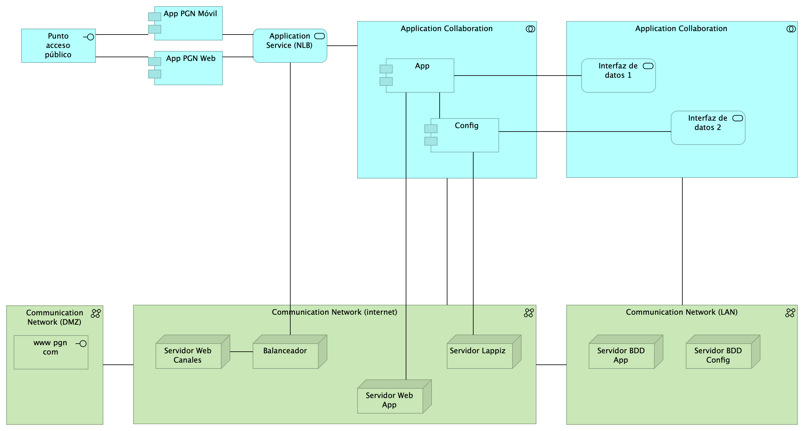

# Arquitectura de Software: Infraestructura
* [Descripción de Infraestructura Migración SUI PGN](#descripción-de-infraestructura-migración-sui-pgn)
	* [Lineabase.1a.SIU componentes. infraestrcutura](#lineabase.1a.siu-componentes.-infraestrcutura)
	* [Lineabase.0.SIU applicación. física](#lineabase.0.siu-applicación.-física)
	* [Seguridad.2. Lineabase.0.SIU Applicación](#seguridad.2.-lineabase.0.siu-applicación)

\newpage

# Descripción de Infraestructura Migración SUI PGN
## Lineabase.1a.SIU componentes. infraestrcutura
{#fig:Lineabase.1a.SIUcomponentes.infraestrcutura width=}

Dependencias de infraestructura entre los servicios que integran el modelo de aplicación de SUI, Migración. 

* Servidor de Canales (App PGN web y móvil)
* Servidor Web App (App SUI)
* Servidor Lappiz (Config SUI)
* Servidor BDD App (Transaccional)
* Servidor BDD Config (Configuración)

### Catálogo de Elementos
| Name| Type| Description| Properties
|:--------|:--------|:--------|:--------|
|**Persistencia**|application-collaboration|||
|**App**|application-component||*plataforma:* node Js *brecha:* 100 |
|**App PGN Móvil**|application-component|A partir de los lineamientos de desarrollo seguro establecidos en The OWASP Foundation recomendados en la “Guía de desarrollo OWASP” y “OWAS Cheat Sheet, se realizaran pruebas de seguridad a partir del analisis de vulnerabilidades, y pruebas de Ethikal Hacking.  Protección de datos personales,  Los sistemas de información que recogen, procesan y almacenan información de los derechos de las personas se deben almacenar de forma adecuada, la información que pueda ser vulnerada puede generar obliaciones legales y éticas con respecto a la perdida de informacion confidencial por parte de ciudadanos del pais.  La informacion contenida en las bases de datos debe tener los mecanismos de cifrado que en otros apartados se han mencionado.  La legislación que hay que tener como referencia, ley 1581 de 2012. Decreto 1377 de 2013 La metodologia empleada tendrá las siguientes fases:  •	FASE DE RECONOCIMIENTO:  Se recolectará toda la información posible, usando diferentes técnicas como: o	Recopilación de dominios/IPs/puertos/servicios o	Recopilación de metadatos o	Uso de Google Dorks. •	ANÁLSIS DE VULNERABILIDADES:  Se analizará la información recopilada en la fase anterior y se realizará el descubrimiento de las vulnerabilidades.  •	EXPLOTACIÓN:  •	Se realizarán todas aquellas acciones que puedan comprometer al sistema auditado, las pruebas a implementar pueden ser de ataques tipo:  o	Inyección de código o	Inclusión de ficheros locales o remotos o	Evasión de autenticación o	Carencia de controles de autorización o	Ejecución de comandos en el lado del servidor o	Ataques tipo Cross Site Request Forgery o	Control de errores o	Gestión de sesiones o	Fugas de información o	Secuestros de sesión o	Comprobación de las condiciones para realizar una denegación de servicio. 	 •	POST EXPLOTACIÓN: En caso de encontrarse una vulnerabilidad que permita realizar otras acciones en el sistema auditado o en su entorno, se realizarán controles adiciones con el objetivo de comprobar la criticidad de esta. No	URL	IP 1.	https://runtimetest.lappiz.io/#/auth/login/PGN_Lappiz 135.181.185.207 |*plantilla:* element-md-bold *brecha:* 100 |
|**App PGN Web**|application-component|A partir de los lineamientos de desarrollo seguro establecidos en The OWASP Foundation recomendados en la “Guía de desarrollo OWASP” y “OWAS Cheat Sheet, se realizaran pruebas de seguridad a partir del analisis de vulnerabilidades, y pruebas de Ethical Hacking.  Los resultados permitirán identificar los requisitos de seguridad que los sistemas de informacion o servicios web deberán cumplir. La metodologia empleada tendrá las siguientes fases:  •	FASE DE RECONOCIMIENTO:  Se recolectará toda la información posible, usando diferentes técnicas como: o	Recopilación de dominios/IPs/puertos/servicios o	Recopilación de metadatos o	Uso de Google Dorks. •	ANÁLSIS DE VULNERABILIDADES:  Se analizará la información recopilada en la fase anterior y se realizará el descubrimiento de las vulnerabilidades.  •	EXPLOTACIÓN:  •	Se realizarán todas aquellas acciones que puedan comprometer al sistema auditado, las pruebas a implementar pueden ser de ataques tipo:  o	Inyección de código o	Inclusión de ficheros locales o remotos o	Evasión de autenticación o	Carencia de controles de autorización o	Ejecución de comandos en el lado del servidor o	Ataques tipo Cross Site Request Forgery o	Control de errores o	Gestión de sesiones o	Fugas de información o	Secuestros de sesión o	Comprobación de las condiciones para realizar una denegación de servicio. 	 •	POST EXPLOTACIÓN: En caso de encontrarse una vulnerabilidad que permita realizar otras acciones en el sistema auditado o en su entorno, se realizarán controles adiciones con el objetivo de comprobar la criticidad de esta. No	URL	IP 1.	https://runtimetest.lappiz.io/#/auth/login/PGN_Lappiz 135.181.185.207 El Login deberá evidenciar el control de errores, al momento de realizar la validación deberá mensaje de error para el caso que se autentique con credenciales erradas. |*plataforma:* angular 11 *brecha:* 100 |
|**Config**|application-component||*plataforma:* cs |
|**Controlador admin**|application-component||*plataforma:* cs |
|**Controlador frontal mvl**|application-component||*plataforma:* js |
|**Controlador frontal web**|application-component|-	Verificados los SSL, se recomienda adquirir SSL seguros, con entidades certificadoras.  Si se desea continuar con SSL de Let's Encrypt, se recomienda automatizar el proceso de actualización dado que al dejar estos en modo actualización manual es probable el olvido de esta actualización (Estos certificados se deben actualizar trimestralmente y no cuentan con las características de seguridad necesarias.  |*plataforma:* js |
|**Controlador funcional**|application-component||*plataforma:* js |
|**Modelo (neg)**|application-component||*plataforma:* cs |
|**Puerto datos 1**|application-component||*plataforma:* js |
|**Puerto datos 2**|application-component||*plataforma:* cs |
|**Seguridad**|application-component||*plataforma:* sql *brecha:* 100 |
|**Transacciones**|application-component||*plataforma:* sql *brecha:* 100 |
|**Utilitario**|application-component||*plataforma:* no-sql |
|**Vista móvil**|application-component||*plataforma:* js |
|**Vista web**|application-component|-	Verificados los SSL, se recomienda adquirir SSL seguros, con entidades certificadoras.  Si se desea continuar con SSL de Let's Encrypt, se recomienda automatizar el proceso de actualización dado que al dejar estos en modo actualización manual es probable el olvido de esta actualización (Estos certificados se deben actualizar trimestralmente y no cuentan con las características de seguridad necesarias.  4.	SERVICIOS IDENTIFICADOS: Servidor web:  Microsoft-IIS/10.0  Marco de Programación: ASP.NET Huellas digitales identificadas:   Huella digital SHA-256 “FC:79:06:7E:F5:24:20:50:F1:C0:74:F7:85:56:B9:05:B7:33:A3:2D:44:A0:48” Huella digital SHA1 “8C:48:BD:E2:F5:18:18:C3:85:96:68:44:2E:28:A0:68:08:2F:0A:BE” |*plataforma:* html |
|**Interfaz de aplicación (runtime)**|application-interface|Servidor web:  Microsoft-IIS/10.0  Marco de Programación: ASP.NET Huellas digitales identificadas:   Huella digital SHA-256 “FC:79:06:7E:F5:24:20:50:F1:C0:74:F7:85:56:B9:05:B7:33:A3:2D:44:A0:48” Huella digital SHA1 “8C:48:BD:E2:F5:18:18:C3:85:96:68:44:2E:28:A0:68:08:2F:0A:BE” |*plataforma:* angular 11 |
|**API externas**|application-service|||
|**Application Service (NLB)**|application-service||*plataforma:* angular 11 *brecha:* 100 |
|**Archivos Compartidos**|application-service|||
|**CDN Contenidos**|application-service||*brecha:* 100 |
|**Doku (gest. doc.)**|application-service||*brecha:* 100 |
|**Identidades**|application-service|||
|**Interfaz de datos 1**|application-service|||
|**Interfaz de datos 2**|application-service|||
|**Interfaz de datos 3**|application-service|||
|**ccccc Proveedores contenidos**|application-service||*brecha:* 100 |
|**Mensaje: JSON**|data-object|||
|**Infraestructura SUI**|grouping|Soporte de infraestructura a los componentes del SUI Migración. Servidores y ambientes de cómputo para la ejecución del software base de los componentes misionales del SUI de PGN. ||
|**PGN SIU**|grouping|El objetivo principal de la arquitectura del SUI de la migración es la centralización de los conceptos misionales: concentrar los conceptos misionales en componentes aislados; dejar por fuera de estos componentes misionales todo lo distintos a la misionalidad de la PGN. Los objetivos secundarios de esta arquitectura SUI de la migración son flexibilidad y extensibilidad. Dichos objetivos son independientes. Es decir, estos pueden ser maximizados sin conclifcto entre ellos. ||
|**Servidor BDD App**|node|Sistema Operativo Windows Server 2019 Standard o Datacenter x64. RAM	8 GB. CPU 64 Bits, 4 Cores > 2 Ghz Discos	SO C: 126 GB, Backup E: 511 GB, SQL Data F: 510 GB, SQL Log   G: 510 GB, TempDB  G: 63.6 GB. ||
|**Servidor BDD Config**|node|Sistema Operativo Windows Server 2019 Standard o Datacenter x64. RAM	8 GB. CPU 64 Bits, 4 Cores > 2 Ghz Discos	SO C: 80 GB, Backup E: 250 GB, SQL Data F: 250 GB, SQL Log G: 250 GB, TempDB  G: 30 GB. ||
|**Servidor Web App**|node|Windows Server 2019 Standard o Datacenter x64. Nombre físico. IP LAN. IP Pública. Windows Server 2019 Standard or Datacenter x64. RAM	8  GB. CPU	64 Bits. 4 Cores de 2 Ghz. Discos	SO C: 126 GB. SO D: 16 GB. ||
|**Servidor Web Canales**|node|Windows Server 2019 Standard o Datacenter x64. Nombre físico. IP LAN. IP Pública. Windows Server 2019 Standard or Datacenter x64. RAM	8  GB. CPU	64 Bits. 4 Cores de 2 Ghz. Discos	SO C: 126 GB. SO D: 16 GB. ||

## Lineabase.0.SIU applicación. física
{#fig:Lineabase.0.SIUapplicación.física width=}

Procuraduría General de la Nación (PGN), módulo SIU migrado, 2023. Elementos físicos que soportan a la aplicación Sistema de Información Único (SIU en adelante) de la PGN, actual Fase I y existente en Fase II. Presentación de componentes de software y tecnologeia física (hardware) implementados en la Fase I y requeridos por Fase II (presente proyecto).

## Representación Arquitectónica
Con una arquitectura orientada a servicios SUI recopila:

1. Runtime: Es el servicio que interactúa con el usuario final (GUI) elaborado en Angular 11
1. API Tx: Servicio api rest base node encargado de realizar las transacciones básicas CRUD
1. API Config / Seguridad. Servicio Web API .Net Framework encargado de gestionar características con la autenticación y configuración

 

### Catálogo de Elementos
| Name| Type| Description| Properties
|:--------|:--------|:--------|:--------|
|**Application Collaboration**|application-collaboration|||
|**Application Collaboration**|application-collaboration|||
|**App**|application-component||*plataforma:* node Js *brecha:* 100 |
|**App PGN Móvil**|application-component|A partir de los lineamientos de desarrollo seguro establecidos en The OWASP Foundation recomendados en la “Guía de desarrollo OWASP” y “OWAS Cheat Sheet, se realizaran pruebas de seguridad a partir del analisis de vulnerabilidades, y pruebas de Ethikal Hacking.  Protección de datos personales,  Los sistemas de información que recogen, procesan y almacenan información de los derechos de las personas se deben almacenar de forma adecuada, la información que pueda ser vulnerada puede generar obliaciones legales y éticas con respecto a la perdida de informacion confidencial por parte de ciudadanos del pais.  La informacion contenida en las bases de datos debe tener los mecanismos de cifrado que en otros apartados se han mencionado.  La legislación que hay que tener como referencia, ley 1581 de 2012. Decreto 1377 de 2013 La metodologia empleada tendrá las siguientes fases:  •	FASE DE RECONOCIMIENTO:  Se recolectará toda la información posible, usando diferentes técnicas como: o	Recopilación de dominios/IPs/puertos/servicios o	Recopilación de metadatos o	Uso de Google Dorks. •	ANÁLSIS DE VULNERABILIDADES:  Se analizará la información recopilada en la fase anterior y se realizará el descubrimiento de las vulnerabilidades.  •	EXPLOTACIÓN:  •	Se realizarán todas aquellas acciones que puedan comprometer al sistema auditado, las pruebas a implementar pueden ser de ataques tipo:  o	Inyección de código o	Inclusión de ficheros locales o remotos o	Evasión de autenticación o	Carencia de controles de autorización o	Ejecución de comandos en el lado del servidor o	Ataques tipo Cross Site Request Forgery o	Control de errores o	Gestión de sesiones o	Fugas de información o	Secuestros de sesión o	Comprobación de las condiciones para realizar una denegación de servicio. 	 •	POST EXPLOTACIÓN: En caso de encontrarse una vulnerabilidad que permita realizar otras acciones en el sistema auditado o en su entorno, se realizarán controles adiciones con el objetivo de comprobar la criticidad de esta. No	URL	IP 1.	https://runtimetest.lappiz.io/#/auth/login/PGN_Lappiz 135.181.185.207 |*plantilla:* element-md-bold *brecha:* 100 |
|**App PGN Web**|application-component|A partir de los lineamientos de desarrollo seguro establecidos en The OWASP Foundation recomendados en la “Guía de desarrollo OWASP” y “OWAS Cheat Sheet, se realizaran pruebas de seguridad a partir del analisis de vulnerabilidades, y pruebas de Ethical Hacking.  Los resultados permitirán identificar los requisitos de seguridad que los sistemas de informacion o servicios web deberán cumplir. La metodologia empleada tendrá las siguientes fases:  •	FASE DE RECONOCIMIENTO:  Se recolectará toda la información posible, usando diferentes técnicas como: o	Recopilación de dominios/IPs/puertos/servicios o	Recopilación de metadatos o	Uso de Google Dorks. •	ANÁLSIS DE VULNERABILIDADES:  Se analizará la información recopilada en la fase anterior y se realizará el descubrimiento de las vulnerabilidades.  •	EXPLOTACIÓN:  •	Se realizarán todas aquellas acciones que puedan comprometer al sistema auditado, las pruebas a implementar pueden ser de ataques tipo:  o	Inyección de código o	Inclusión de ficheros locales o remotos o	Evasión de autenticación o	Carencia de controles de autorización o	Ejecución de comandos en el lado del servidor o	Ataques tipo Cross Site Request Forgery o	Control de errores o	Gestión de sesiones o	Fugas de información o	Secuestros de sesión o	Comprobación de las condiciones para realizar una denegación de servicio. 	 •	POST EXPLOTACIÓN: En caso de encontrarse una vulnerabilidad que permita realizar otras acciones en el sistema auditado o en su entorno, se realizarán controles adiciones con el objetivo de comprobar la criticidad de esta. No	URL	IP 1.	https://runtimetest.lappiz.io/#/auth/login/PGN_Lappiz 135.181.185.207 El Login deberá evidenciar el control de errores, al momento de realizar la validación deberá mensaje de error para el caso que se autentique con credenciales erradas. |*plataforma:* angular 11 *brecha:* 100 |
|**Config**|application-component||*plataforma:* cs |
|**Punto acceso público**|application-interface|URL tipo C HTTP||
|**Application Service (NLB)**|application-service||*plataforma:* angular 11 *brecha:* 100 |
|**Interfaz de datos 1**|application-service|||
|**Interfaz de datos 2**|application-service|||
|**Communication Network (DMZ)**|communication-network|||
|**Communication Network (LAN)**|communication-network|||
|**Communication Network (internet)**|communication-network|||
|**Balanceador**|node|||
|**Servidor BDD App**|node|Sistema Operativo Windows Server 2019 Standard o Datacenter x64. RAM	8 GB. CPU 64 Bits, 4 Cores > 2 Ghz Discos	SO C: 126 GB, Backup E: 511 GB, SQL Data F: 510 GB, SQL Log   G: 510 GB, TempDB  G: 63.6 GB. ||
|**Servidor BDD Config**|node|Sistema Operativo Windows Server 2019 Standard o Datacenter x64. RAM	8 GB. CPU 64 Bits, 4 Cores > 2 Ghz Discos	SO C: 80 GB, Backup E: 250 GB, SQL Data F: 250 GB, SQL Log G: 250 GB, TempDB  G: 30 GB. ||
|**Servidor Web App**|node|Windows Server 2019 Standard o Datacenter x64. Nombre físico. IP LAN. IP Pública. Windows Server 2019 Standard or Datacenter x64. RAM	8  GB. CPU	64 Bits. 4 Cores de 2 Ghz. Discos	SO C: 126 GB. SO D: 16 GB. ||
|**Servidor Web Canales**|node|Windows Server 2019 Standard o Datacenter x64. Nombre físico. IP LAN. IP Pública. Windows Server 2019 Standard or Datacenter x64. RAM	8  GB. CPU	64 Bits. 4 Cores de 2 Ghz. Discos	SO C: 126 GB. SO D: 16 GB. ||
|**www pgn com**|technology-interface|||

## Seguridad.2. Lineabase.0.SIU Applicación
{#fig:Seguridad.2.Lineabase.0.SIUApplicación width=}

## Representación Arquitectónica
Con una arquitectura orientada a servicios SUI recopila:

1. Runtime: Es el servicio que interactúa con el usuario final (GUI) elaborado en Angular 11
1. API Tx: Servicio api rest base node encargado de realizar las transacciones básicas CRUD
1. API Config / Seguridad. Servicio Web API .Net Framework encargado de gestionar características con la autenticación y configuración

### Catálogo de Elementos
| Name| Type| Description| Properties
|:--------|:--------|:--------|:--------|
|**Application Collaboration**|application-collaboration|||
|**Application Collaboration**|application-collaboration|||
|**App**|application-component||*plataforma:* node Js *brecha:* 100 |
|**App PGN Móvil**|application-component|A partir de los lineamientos de desarrollo seguro establecidos en The OWASP Foundation recomendados en la “Guía de desarrollo OWASP” y “OWAS Cheat Sheet, se realizaran pruebas de seguridad a partir del analisis de vulnerabilidades, y pruebas de Ethikal Hacking.  Protección de datos personales,  Los sistemas de información que recogen, procesan y almacenan información de los derechos de las personas se deben almacenar de forma adecuada, la información que pueda ser vulnerada puede generar obliaciones legales y éticas con respecto a la perdida de informacion confidencial por parte de ciudadanos del pais.  La informacion contenida en las bases de datos debe tener los mecanismos de cifrado que en otros apartados se han mencionado.  La legislación que hay que tener como referencia, ley 1581 de 2012. Decreto 1377 de 2013 La metodologia empleada tendrá las siguientes fases:  •	FASE DE RECONOCIMIENTO:  Se recolectará toda la información posible, usando diferentes técnicas como: o	Recopilación de dominios/IPs/puertos/servicios o	Recopilación de metadatos o	Uso de Google Dorks. •	ANÁLSIS DE VULNERABILIDADES:  Se analizará la información recopilada en la fase anterior y se realizará el descubrimiento de las vulnerabilidades.  •	EXPLOTACIÓN:  •	Se realizarán todas aquellas acciones que puedan comprometer al sistema auditado, las pruebas a implementar pueden ser de ataques tipo:  o	Inyección de código o	Inclusión de ficheros locales o remotos o	Evasión de autenticación o	Carencia de controles de autorización o	Ejecución de comandos en el lado del servidor o	Ataques tipo Cross Site Request Forgery o	Control de errores o	Gestión de sesiones o	Fugas de información o	Secuestros de sesión o	Comprobación de las condiciones para realizar una denegación de servicio. 	 •	POST EXPLOTACIÓN: En caso de encontrarse una vulnerabilidad que permita realizar otras acciones en el sistema auditado o en su entorno, se realizarán controles adiciones con el objetivo de comprobar la criticidad de esta. No	URL	IP 1.	https://runtimetest.lappiz.io/#/auth/login/PGN_Lappiz 135.181.185.207 |*plantilla:* element-md-bold *brecha:* 100 |
|**App PGN Web**|application-component|A partir de los lineamientos de desarrollo seguro establecidos en The OWASP Foundation recomendados en la “Guía de desarrollo OWASP” y “OWAS Cheat Sheet, se realizaran pruebas de seguridad a partir del analisis de vulnerabilidades, y pruebas de Ethical Hacking.  Los resultados permitirán identificar los requisitos de seguridad que los sistemas de informacion o servicios web deberán cumplir. La metodologia empleada tendrá las siguientes fases:  •	FASE DE RECONOCIMIENTO:  Se recolectará toda la información posible, usando diferentes técnicas como: o	Recopilación de dominios/IPs/puertos/servicios o	Recopilación de metadatos o	Uso de Google Dorks. •	ANÁLSIS DE VULNERABILIDADES:  Se analizará la información recopilada en la fase anterior y se realizará el descubrimiento de las vulnerabilidades.  •	EXPLOTACIÓN:  •	Se realizarán todas aquellas acciones que puedan comprometer al sistema auditado, las pruebas a implementar pueden ser de ataques tipo:  o	Inyección de código o	Inclusión de ficheros locales o remotos o	Evasión de autenticación o	Carencia de controles de autorización o	Ejecución de comandos en el lado del servidor o	Ataques tipo Cross Site Request Forgery o	Control de errores o	Gestión de sesiones o	Fugas de información o	Secuestros de sesión o	Comprobación de las condiciones para realizar una denegación de servicio. 	 •	POST EXPLOTACIÓN: En caso de encontrarse una vulnerabilidad que permita realizar otras acciones en el sistema auditado o en su entorno, se realizarán controles adiciones con el objetivo de comprobar la criticidad de esta. No	URL	IP 1.	https://runtimetest.lappiz.io/#/auth/login/PGN_Lappiz 135.181.185.207 El Login deberá evidenciar el control de errores, al momento de realizar la validación deberá mensaje de error para el caso que se autentique con credenciales erradas. |*plataforma:* angular 11 *brecha:* 100 |
|**Config**|application-component||*plataforma:* cs |
|**Punto acceso público**|application-interface|URL tipo C HTTP||
|**Application Service (NLB)**|application-service||*plataforma:* angular 11 *brecha:* 100 |
|**Interfaz de datos 1**|application-service|||
|**Interfaz de datos 2**|application-service|||
|**Autenticación**|business-object|Con el objetivo de incrementar el nivel de seguridad, para el proceso de autenticación se tendrán en cuenta las siguientes consideraciones:   Validación del proceso de gestión de usuarios: La fortaleza de la autenticación dependerá del proceso de gestión de usuarios implementado por parte de la entidad. Se debe tener en cuenta los lineamientos definidos en la política Específica de Control de Acceso.   Autenticación con integración de Windows: La autenticación permitirá que los usuarios asignados al dominio, una vez que se ingresen las credenciales, y realizada la validación, se autorizará el acceso a los servicios y/o soluciones a partir de la integración del directorio activo con la integración del LDAP – (Lightweight Directory Access Protocol).   Los tipos de autenticación realizadas a partir de las identidades administradas de los recursos de Azure, entidades de Servicio y Certificados, podrán ser integrado con los dominios del directorio activo (DA) local. Por lo que respecta a la autenticación, será generado con la asignación de usuarios y credenciales definidas alineadas con la política Específica de Control de Acceso., a partir de la integración será validado el ingreso a las diferentes soluciones y/o sistemas de información de la PGN.   Manejo y uso de contraseñas: Los servidores públicos deberán tener en cuenta los lineamientos definidos para la creación y gestión de contraseñas del Sistema de Gestión de Seguridad de la Información SGSI de la Procuraduría General de la Nación.  Utilización de canales cifrados: El proceso de autenticación tendrá mecanismos de transmisión seguro. El uso del TLS (Transport Layer Security), será necesario para el acceso a la página de autenticación que ayude a garantizar la autenticidad de la aplicación a los funcionarios, como en la transmisión de las credenciales.   Bloqueo de cuentas: Aquellas cuentas sobre las que se han realizados múltiples intentos de conexiones fallidas, cinco (5) intentos erróneos, se tendrá implementado un bloqueo temporal o permanente como mecanismo de seguridad para evitar amenazas de ataques.  ||
|**Autorización**|business-object|Metodología  Los mecanismos de autorización para el acceso a los sistemas de información de la procuraduría general de la nación describen la forma de cómo se restringe el acceso a los diferentes módulos (Misionales (SIM), Registros de Inhabilidades (SIRI), Nómina, Control Interno y relatoría, entre otros.), y que se considera un mecanismo de protección, que ayuda a reaccionar ante cualquier operación no autorizada. El control de acceso basado en roles (RBAC), enfoca la idea de que a los funcionarios se les otorgue los permisos de acceso a los recursos, basados en los roles y/o perfiles que este posee. Este control posee dos características fundamentales: i) los accesos son controlados por medio de los roles y/o perfiles asignados, quiere decir, a los servidores públicos, contratistas, terceros y otros colaboradores autorizados para interactuar con los sistemas de información se le asignan los roles y el encargado/responsable definirá los permisos, que a su vez están relacionados con los roles, ii) Los roles pueden ser definidos a nivel jerárquico, es decir que un rol podrá ser miembro de otro rol.   Un proceso de autorización basado en roles, identifica tres factores importantes, i) Todos los servidores públicos, contratistas, terceros y otros  Colaboradores, deben tener un rol asignado, si no es asignado no podrá realizar ninguna acción relacionada con el acceso, ii) un usuario podrá hacer uso de los permisos asociados a los roles asignados, el cual deberá realizar el inicio de sesión el usuario asignado del Directorio activo (DA), iii) los servidores públicos, contratistas, terceros y otros, solo podrán realizar acciones para las cuales han sido autorizados por medio de la activación de sus roles y/o perfiles.   EL control definido para los accesos basados en roles RBAC, permitirá que solo las personas autorizadas de la PGN podrán acceder a ciertos recursos (programas, equipos, aplicaciones, bases de datos, etc.) definido por sus funciones laborales, lo que permitirá controlar los accesos desde diferentes escenarios: Sistemas de información, redes y aplicaciones.  Gestión de identidades y Control de acceso:   Gestor de identidades: En esta gestión se planifica el ciclo de vida de las identidades de usuario y se realizan los procesos de sincronización, de acuerdo a los suministros de accesos establecidos por la entidad, los cuales son integrados con el servidor que gestiona la identidad y control de acceso.   Gestor de roles: La asignación de roles es sincronizada con la identidad de usuario en el servidor de dominio. Para esta gestión se crean las reglas y condiciones que determinan si un usuario puede o no pertenecer a un rol definido por la entidad.  Para el gobierno y gestión de identidades y de acceso, se identificó como primera medida la implementación de la siguiente metodología.  REGLAS PARA LA CREACIÓN DE USUARIOS.  Identificación de Mecanismos:    En este ítem se deben identificar las herramientas con las que cuenta la    entidad, las cuales deberán ser registradas en el documento denominado: “Clasificación y gestión de usuarios, roles y perfiles.xlsx / Hoja_1 (Mecanismos)”.  Identificación de Roles y Privilegios  Este ítem proporciona al sistema la definición de las políticas organizacionales en cuanto a la definición de los privilegios y roles de los diferentes actores en cada uno de los aplicativos con los que estos interactúan dentro de sus funciones, registradas en el documento denominado: “Clasificación y gestión de usuarios, roles y perfiles.xlsx / Hoja_2 (Roles)”.  Aprovisionamiento de cuentas  Este ítem establece el proceso adecuado para el aprovisionamiento y des aprovisionamiento de cuentas de usuarios en las diferentes aplicaciones, permitiendo toda la gestión de ellas por medio de un sistema de directorio único y centralizado, Este aprovisionamiento se encuentra registrado en el documento denominado: “Clasificación y gestión de usuarios, roles y perfiles.xlsx / Hoja_4 y Hoja_5 (Permisos)”.  Establecimiento de mecanismos de control de acceso:   Este ítem controla que usuarios tienen permitido el acceso a los diferentes aplicativos o herramientas dentro de la organización permitiendo segregar las funciones dependiendo del rol del usuario en cada sistema, Este establecimiento se encuentra registrado en el documento denominado: “Clasificación y gestión de usuarios, roles y perfiles.xlsx / Hoja_3 (Acceso)”.  Definición de Privilegios y accesos.   Los accesos y privilegios serán identificados en la matriz, encargado identificar cada uno de los roles y perfiles que se tendrá cada usuario hacia los sistemas de información cumpliendo con el principio del menor privilegio, teniendo en cuenta que los usuarios deberán tener exclusivamente los permisos y privilegios que necesita para el desarrollo de sus actividades. La matriz identificará i) los roles que se deben crear para cada sistema de información, ii) los privilegios que requiere cada rol del sistema y iii) los niveles de accesos requeridos, (Consultar, Modificar, Eliminar) (CRUD) y iv) Tipos de usuarios, roles que pueden ser asignados al perfil, entre otros.   Configuración de permisos  La configuración con de los perfiles con sus accesos y privilegios en los sistemas de información se debe realizar empleando las herramientas propias de la procuraduría general de la nacional PGN, y serán asignados los permisos según la matriz de roles y permisos.   Identificación de Mecanismos:  En este ítem se deben identificar las herramientas con las que cuenta la    entidad, las cuales deberán ser registradas en el documento denominado: “Clasificación y gestión de usuarios, roles y perfiles.xlsx / Hoja_1 (Mecanismos)”.  Identificación de Roles y Privilegios  Este ítem proporciona al sistema la definición de las políticas organizacionales en cuanto a la definición de los privilegios y roles de los diferentes actores en cada uno de los aplicativos con los que estos interactúan dentro de sus funciones, registradas en el documento denominado: “Clasificación y gestión de usuarios, roles y perfiles.xlsx / Hoja_2 (Roles)”.  Aprovisionamiento de cuentas  Este ítem establece el proceso adecuado para el aprovisionamiento y des aprovisionamiento de cuentas de usuarios en las diferentes aplicaciones, permitiendo toda la gestión de ellas por medio de un sistema de directorio único y centralizado, Este aprovisionamiento se encuentra registrado en el documento denominado: “Clasificación y gestión de usuarios, roles y perfiles.xlsx / Hoja_4 y Hoja_5 (Permisos)”.  Establecimiento de mecanismos de control de acceso:   Este ítem controla que usuarios tienen permitido el acceso a los diferentes aplicativos o herramientas dentro de la organización permitiendo segregar las funciones dependiendo del rol del usuario en cada sistema, Este establecimiento se encuentra registrado en el documento denominado: “Clasificación y gestión de usuarios, roles y perfiles.xlsx / Hoja_3 (Acceso)”.  Definición de Privilegios y accesos.   Los accesos y privilegios serán identificados en la matriz, encargado identificar cada uno de los roles y perfiles que se tendrá cada usuario hacia los sistemas de información cumpliendo con el principio del menor privilegio, teniendo en cuenta que los usuarios deberán tener exclusivamente los permisos y privilegios que necesita para el desarrollo de sus actividades. La matriz identificará i) los roles que se deben crear para cada sistema de información, ii) los privilegios que requiere cada rol del sistema y iii) los niveles de accesos requeridos, (Consultar, Modificar, Eliminar) (CRUD) y iv) Tipos de usuarios, roles que pueden ser asignados al perfil, entre otros.   Configuración de permisos  La configuración con de los perfiles con sus accesos y privilegios en los sistemas de información se debe realizar empleando las herramientas propias de la procuraduría general de la nacional PGN, y serán asignados los permisos según la matriz de roles y permisos.  ||
|**Cifrado de Datos en tránsito**|business-object|Proteger la información propia de la PGN utilizando mecanismos de cifrado que permita garantizar los pilares de Segurida de la Información Confidencialidad e integridad, asimismo reducir los riesgos de la información mediante la ayuda de Técnicas Criptograficas.  Como mecanismos se propone implementar estos  mecanismos de cifrado, como el protocolo TLS ( Transport Layer Security) que permite a dos partes identificarse y autenticarse entre sí y comunicarse con confidencialidad e integridad de datos a partir de la conexión del usuario y un servidor WEB. Se propone integrar certificados SSL, que permite cifrar la información confidencial a fin de que solo los autorizados puedan tener acceso a ella, y asi evitar manipulacion de información confidencial. La Seguridad  que brinda SSL, da garantía para acceder a los aplicativos de PNG.  Como implementar certificados SSL? Podran ser adquiridos a través del proveedor de dominios. TLS el protocolo que surge para reforzar la seguridad de los certificados SSL, que funciona como mecanismo de encriptación para que sea realmente transparente el envio de la información, proporcionando una autenticación solida, restringiendo la manipulación, interceptación y alteración de mensajes. La ultima versión del TLS es la 1.3 ||
|**Cifrado de datos en tránsito**|business-object|Proteger la información propia de la PGN utilizando mecanismos de cifrado que permita garantizar los pilares de Segurida de la Información Confidencialidad e integridad, asimismo reducir los riesgos de la información mediante la ayuda de Técnicas Criptograficas. Como mecanismos se propone implementar estos  mecanismos de cifrado, como el protocolo TLS ( Transport Layer Security) que permite a dos partes identificarse y autenticarse entre sí y comunicarse con confidencialidad e integridad de datos a partir de la conexión del usuario y un servidor WEB. Se propone integrar certificados SSL, que permite cifrar la información confidencial a fin de que solo los autorizados puedan tener acceso a ella, y asi evitar manipulacion de información confidencial. La Seguridad  que brinda SSL, da garantía para acceder a los aplicativos de PNG.  Como implementar certificados SSL? Podran ser adquiridos a través del proveedor de dominios. TLS el protocolo que surge para reforzar la seguridad de los certificados SSL, que funciona como mecanismo de encriptación para que sea realmente transparente el envio de la información, proporcionando una autenticación solida, restringiendo la manipulación, interceptación y alteración de mensajes. La ultima versión del TLS es la 1.3||
|**Communication Network (DMZ)**|communication-network|||
|**Communication Network (LAN)**|communication-network|||
|**Communication Network (internet)**|communication-network|||
|**Balanceador**|node|||
|**Firewall BDD**|node||*brecha:* 100 |
|**Network Firewall/WAF**|node||*brecha:* 100 |
|**Servidor BDD App**|node|Sistema Operativo Windows Server 2019 Standard o Datacenter x64. RAM	8 GB. CPU 64 Bits, 4 Cores > 2 Ghz Discos	SO C: 126 GB, Backup E: 511 GB, SQL Data F: 510 GB, SQL Log   G: 510 GB, TempDB  G: 63.6 GB. ||
|**Servidor BDD Config**|node|Sistema Operativo Windows Server 2019 Standard o Datacenter x64. RAM	8 GB. CPU 64 Bits, 4 Cores > 2 Ghz Discos	SO C: 80 GB, Backup E: 250 GB, SQL Data F: 250 GB, SQL Log G: 250 GB, TempDB  G: 30 GB. ||
|**Servidor Web App**|node|Windows Server 2019 Standard o Datacenter x64. Nombre físico. IP LAN. IP Pública. Windows Server 2019 Standard or Datacenter x64. RAM	8  GB. CPU	64 Bits. 4 Cores de 2 Ghz. Discos	SO C: 126 GB. SO D: 16 GB. ||
|**Servidor Web Canales**|node|Windows Server 2019 Standard o Datacenter x64. Nombre físico. IP LAN. IP Pública. Windows Server 2019 Standard or Datacenter x64. RAM	8  GB. CPU	64 Bits. 4 Cores de 2 Ghz. Discos	SO C: 126 GB. SO D: 16 GB. ||
|**Sistema de Seguridad (LDAP) 1**|node|Sistema de Seguridad (LDAP) 1. Control de acceso internet,  La autenticación podrá estar integrada con el directorio activo, a partir de la generación de codigo para ek ingreso con 2FA, que podrá generar un código la plataforma de correo corporativo, el cual solicitará el codigo de autenticacion y una vez ingreado podrá redirigir al sitio. |*brecha:* 100 |
|**Sistema de Seguridad (LDAP) 2**|node|Sistema de Seguridad (LDAP) 2. Control de acceso internet,  La solución se podra integrar con el directorio activo, a partir de la generación del 2FA, que podrá generar un  codigo por desde la plataforma de office 365, el cual solicitará el codigo de autenticacion y una vez ingreado podrá acceder al sitio.  |*brecha:* 100 |
|**www pgn com**|technology-interface|||

``Generated on: Thu Oct 19 2023 09:18:43 GMT-0500 (COT)``